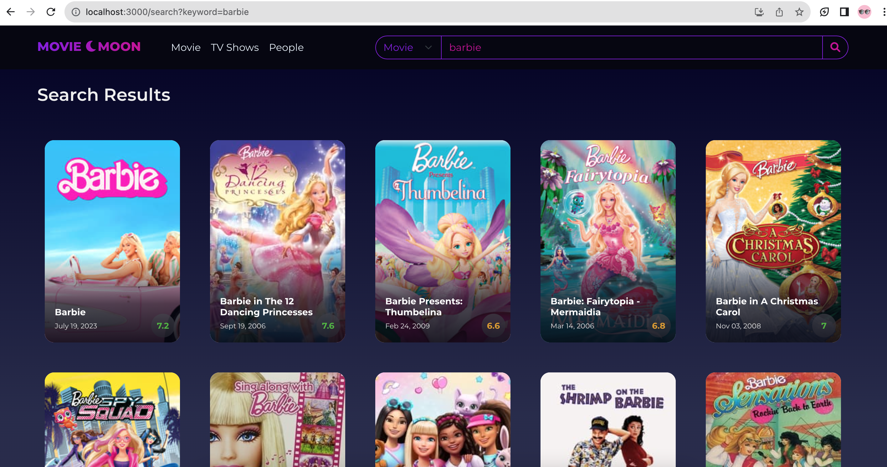

# Demo
<b>Visit [https://movie-moon.vercel.app/](https://movie-moon.vercel.app/)</b>
 Hosted by [Vercel](https://vercel.com//)

# About
MovieMoon is a React based movie website that allows users to search for movies, TV shows, and people.
Used [The Movie DB](https://www.themoviedb.org/) API, functional components, Typescript, Hooks, Redux, [Bootstrap](https://getbootstrap.com/), etc.

# Features
- Search Movies, TV Shows, and People : users can search for movies, TV shows, and people
- Popular Movies and TV Shows : displays the list of popular movies and TV shows
- Trending Movies: displays the list of trending movies and TV shows
- Movie and TV Show Details: users can view detailed information about each movie and TV show
- Cast list: displays casts for each movie and TV show
- People Details : users can view detailed information about each people biography and filmography
- Rating Number : users can view the number of rating from each movie and TV show

# Screenshots
1. Homepage

2. Search results

3. Movie details

4. People details 

5. Cast list

# Installation and How to Use

## Step 1: Download and Extract the Code

Firstly, download the entire website code and extract the ZIP file to a folder on your local system.

## Step 2: Obtain the TMDB Movies API Key

Before starting the website, you will need to obtain the TMDB Movies API key. 

### ▶️ Get TMDB API Key 

- Go to https://www.themoviedb.org/ and log in.
- Click on your user profile picture in the navigation bar, and select "Settings".
- In the settings, select "API" and generate an API key.
- Put the generated API key to variable `REACT_APP_TMDB_API_KEY` and add to your `.env` file.

## Step 3: Package Installation

- Run `yarn` or `yarn install`

## Step 3: Run the App

- Run `yarn start` to run in dev mode
- Run `yarn build` to run in prod mode
- Run `yarn test` for testing

